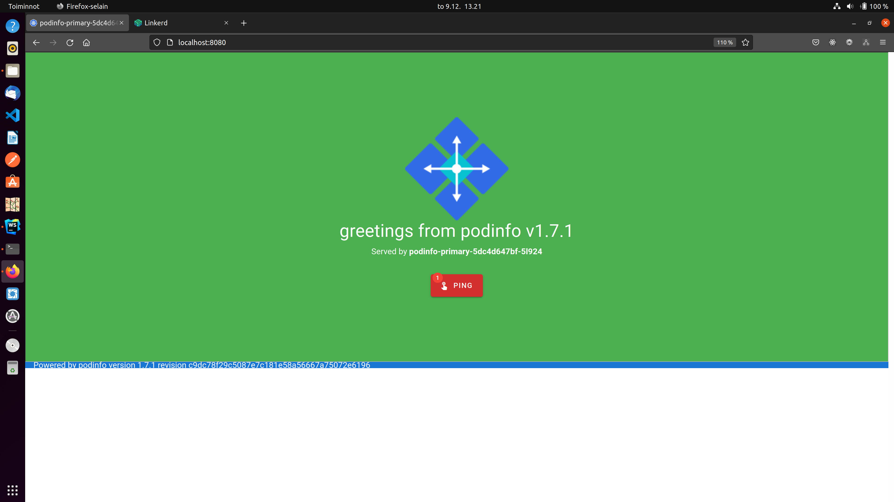

# DevOps with Kubernetes - 2021

### Introduction to Kubernetes practices

MOOC - DevOps with Kubernetes 2021 - University of Helsinki

### Exercise 5.03: Learn from external material

.

### Exercise 5.04: Platform comparison

#### Rancher vs. OpenShift (and why Rancher would be the better option)

- Totally open source project
- Easy and fast to install
- Version upgrades are smooth
- Follows and extends CNCF standards
- Easy to use
- Version upgrades are smooth
- Managing multiple K8s clusters

### Exercise 5.06: Landscape

.

In the landscape picture green circles represent technologies that I know about and have used. On the contrary, the blue
circles represent technologies that I have used mainly indirectly.

- I've used MongoDB outside of the course
- PostgreSQL were used to store todos (Project) and pingpongs (PingPong App)
- I've used MySQL outside of the course
- I've used Redis outside of the course
- I used NATS for messaging stream in Part 4
- I've used RabbitMQ outside of the course
- I've used AWS outside of the course
- I've used Digital Ocean outside of the course
- I've used Ansible outside of the course
- Google Kubernetes Engine were used in Part 3
- Traefik were used by the ingress controller, but I don't have in-depth knowledge how it works.
- I used HELM to install Prometheus (Part2) and NATS (Part 4)
- I indirectly used Flannel as k3d (through k3s) uses it. But I have no clue how it works.
- I indirectly used Prometheus while viewing data in Grafana. But Prometheus is mostly a black-box to me.
- I've used Grafana outside of the course
- I've used GitHub Actions outside of the course
- I've used Nginx outside of the course
- I've used Linkerd and Contour during part 5, but those are mainly a black-box to me. 

