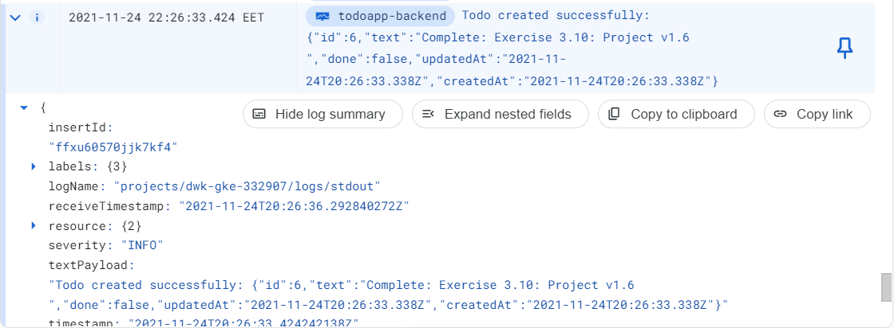

### Exercise 3.06: DBaaS vs DIY

#### DBaaS

| Pros      | Cons |
| ----------- | ----------- |
| Very easy to setup     | Configuration might not be easy if the base setup does not suffice       |
| A lot of features available   | Rather expensive (overkill for toy applications)       |
| Automatic backups   | Documentation is not the most intuitive       |
| Scales automatically   |     |
| Fully "managed"  |       |
| Security out of the box  |       |

#### DIY

| Pros      | Cons |
| ----------- | ----------- |
| Relatively easy to setup     | Maintenance requires much more from the user       |
| Much cost-effective solution vs Cloud SQL   | Data backup is much harder than with Cloud SQL  |
| | "Why Is Storage On Kubernetes So Hard" | 

### Exercise 3.07: Commitment

I decided to use the PersistentVolumeClaim solution due to fact that is just works. However, I tried the Cloud SQL with
Postgres but never succeeded to connect to the database
(and wasted too much of my time because of that!).

### Exercise 3.10: Project v1.6

.

